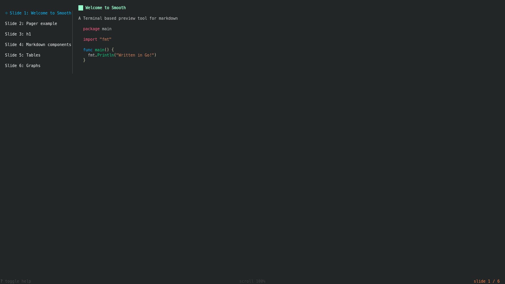

# Smooth

`Smooth` is a terminal based preview tool for `markdown`.
 

## Features

- Turning: turn next/previous slide
- Scroll: scroll up/down slide
- Search: search word
- Tagbar: a preview of slides


## Install

### Go

```shell
go install github.com/0x00-ketsu/smooth
```

From source
```shell
git clone https://github.com/0x00-ketsu/smooth
cd smooth
make build
```


## Usage

### Quickly

Create(or copy an exist) a markdown file contains your slides, here's a simple example:

```markdown
# Welcome to Smooth
A Terminal based preview tool for markdown

---

# h1
## h2
### h3
#### h4
##### h5
###### h6

---

# Markdown components
You can use everything in markdown!
* Like bulleted list
* You know the deal

1. Numbered lists too

---

# Tables

| Tables | Too    |
| ------ | ------ |
| Even   | Tables |
```

Then, run:
```shell
smooth example.md 
```

`smooth` is accepts input from `stdin`:
```
curl http://example.com/smooth.md | smooth
```

### Keymaps

#### Slide

Go to specific slide:
- number: `1`-`9`

Go to first slide:
- `g`

Go to last slide:
- `G`

Go to previous slide:
- `h`

Go to next slide:
- `l`

Scroll donw/up slide:
- `j`: scroll down
- `k`: scroll up

#### Search

- `/`: active search
- `n`: goto next slide if search word is matched
- `N`: goto previous slide if search word is matched

#### Tagbar

Toggle Tagbar, default is hide
- `t`

#### Help

- `?`

#### Quit

- `q` `esc` `ctrl-c`


## Inspiration by

- [lookatme](https://github.com/d0c-s4vage/lookatme) by James Johnson
- [slides](https://github.com/maaslalani/slides) by Maas Lalani

## License
MIT
